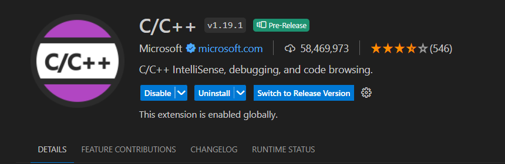
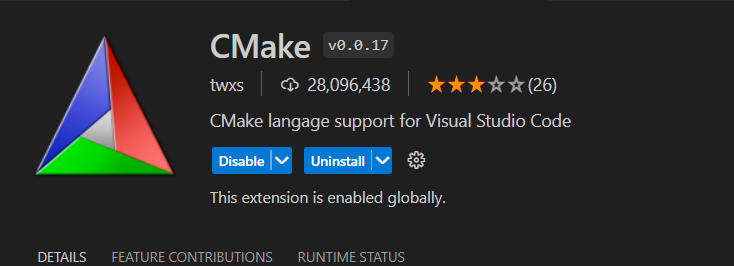
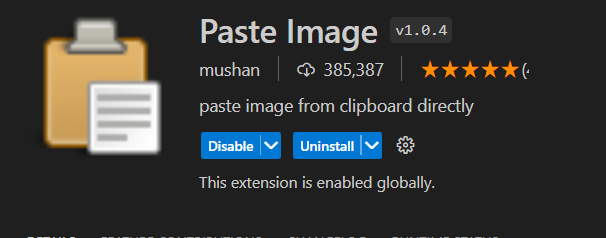
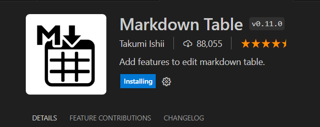

# VS Code Shortcut
| 快捷键             | 作用                 |
| ------------------ | -------------------- |
| `ctrl+b`           | 显示隐藏左侧目录     |
| `ctrl+alt+up/down` | 复制当前行           |
| `ctrl+~`           | 控制台终端显示与隐藏 |
| `shift+alt+f`      | 代码格式化           |
| `shift+alt+n`      | 新建窗口             |
| `ctrl+1/2/3`       | 拆分窗口             |
| `ctrl+[/]`         | 代码增加/减少缩进    |
| `ctrl++/-`         | 字体放大或缩小       |
| `ctrl+w`           | 关闭窗口             |
| `ctrl+kw`          | 关闭所有窗口         |
| `ctrl+shift+f`     | 全局查找文件         |
| `ctrl+k+0-9`       | 折叠代码             |
| `ctrl+k+j`         | 完全展开代码         |
| `ctrl+shift+k`     | 删除行               |
| `ctrl+kf`          | 格式化选中代码       |
| `ctrl+h`           | 全局替换             |
| `ctrl+alt+ +/-`    | 代码光标前进或者后退 |

# Common 
## c/c++
c/c++ 
For c/c++ plugins, code redirection and other function can be implemented.

## CMake
This plugins for `cmake`. It can provide code prompts, syntax check and more when write CMakeLists.txt.

## Go
This plugins is for `goclang` code. This plugins can provide goclang program syntax check and code prompts. But it need install go package liking gopls, et.

## past Image 
This plugins is very convenient for pasting images in Markdown notes. The location of saving image can set by configuration. Put image shortcuts is `ctrl+alt+v`. This is a very useful plugin.

## Markdown table
This plugin is very convenient for insert a table in Markdown notes. You just need to write the header and use TAB key to quick fill the table structrue.
