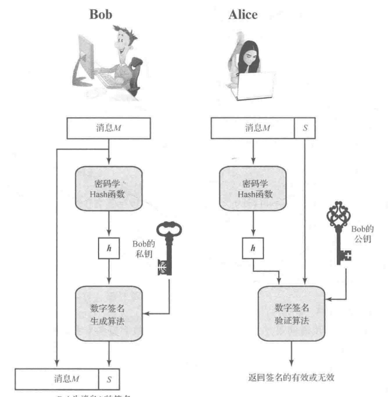
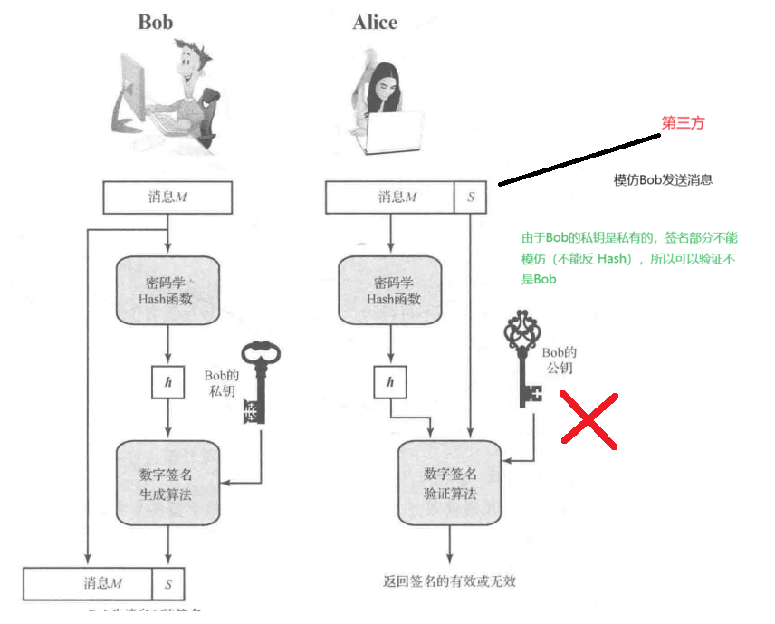
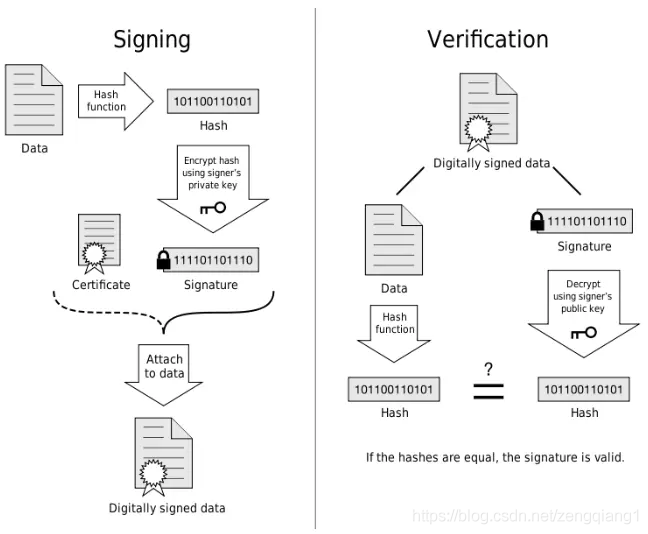
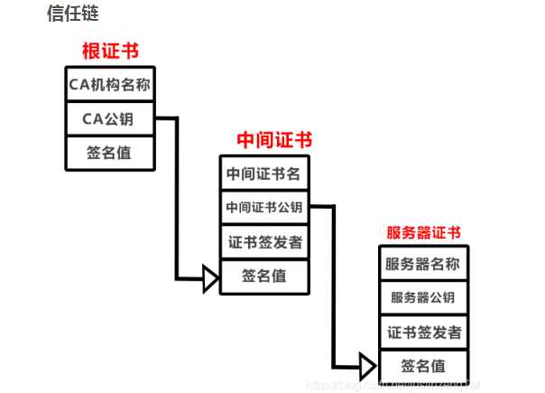

# 信息安全
## 1. 加密算法 
加密算法分为对称加密和非对称加密
### 1.1 对称加密
对称加密使用的加密密钥和解密密钥是同一个，直接使用对称加密的话，可能在互联网中被**中间人**截取到***密钥***，然后窃听消息内容。
#### 1.1.1 常用的的对称加密算法
##### DES（Data Encryption Standard）
数据加密标准，速度较快，适用于加密大量数据的场合。
##### 3DES（Triple DES）
基于DES，对一块数据用三个不同的密钥进行三次加密，强度更高。 
##### AES（Advanced Encryption Standard）
高级加密标准，是下一代的加密算法标准，速度快，安全级别高；
#### 1.1.2 对称加密算法特点
1. 加密方和解密方使用同一个密钥；
2. 加解密的速度比较快，适合数据比较长时使用；
3. 密钥传输的过程不安全，且容易被破解，密钥管理也比较麻烦。
### 1.2 非对称加密算法
非对称加密的加密使用一个密钥，解密使用另一个密钥。这两个密钥被称为私钥和公钥。其中公钥是所有人都可以认领的，私钥是保密，只有其owner知道。非对称加密就解决了对称加密时，可能出现的：在密钥交换时，被第三人窃取，然后窃听或者更改消息内容的情况。在非对称加密时，*直接将各自的公钥通过网络传输*，第三方即使截取到公钥，也没有对应的**私钥进行解密**，就无法窃取到消息的内容。

但是这种情况还是存在这样的Case：第三方使用发送方的公钥，**冒充发送方发送消息**，或者**篡改消息内容**，因为发送方的公钥能够在网络中获取。这个问题的解决就是通过数字签名，使用数字签名能够验证消息是否被篡改。

在进行信息的加密传输时，发送方使用接收方的公钥进行加密，接收方使用自己的私钥进行解密。在进行信息签名验证时，发送方使用自己的私钥进行签名，然后接收方使用发送方的公钥进行验签。
其加密过程如下
```
// 发送方和接收方各有一对密钥，发送方使用公钥加密，然后接收方使用发送方的私钥进行解密
// 公钥 Kpb
// 私钥 Kpr
// 发送方消息 M

// 加密过程：
E = ENC(M, Kpb)

// 解密过程：
M = DEC(E, Kpr)
```
#### 常用的非对称加密算法
##### RSA 
RSA是三个创始人的字母首字母，它是一个支持变长密钥的公共密钥算法，需要加密的文件块的长度也是可变的。RSA的安全性是基于极大整数因数分解的难度。换言之，对一极大整数做因数分解愈困难，RSA算法愈可靠。假如有人找到一种快速因数分解的算法的话，那么用RSA加密的信息的可靠性就肯定会极度下降。但找到这样的算法的可能性是非常小的。到目前为止，世界上还没有任何可靠的攻击RSA算法的方式。只要其钥匙的长度足够长，用RSA加密的信息实际上是不能被解破的。
##### DSA（Digital Signature Algorithm）
数字签名算法，是一种标准的 DSS（数字签名标准）
##### ECC（Elliptic Curves Cryptography）
椭圆曲线密码编码学

## 消息摘要
消息摘要可以将消息哈希成一个长度固定的唯一值。该过程不可逆，即不能通过摘要反推明文。消息摘要可以降低消息的长度，在数字签名时，能够降低计算消耗，因为数字签名使用的是非对称加密，消耗资源较大，如果对消息计算出不可逆的摘要，就可以降低此成本。
常用的消息摘要算法有MD5、SHA1、SHA256、SHA512等。

## 数字签名
数字签名（又称公钥数字签名）是只有信息的发送者才能产生的别人无法伪造的一段数字串，这段数字串同时也是对信息的发送者发送信息真实性的一个有效证明。

数字签名使用非对称加密方法实现。为了降低计算成本消耗，计算数字签名时，会先计算出消息摘要，使用摘要进行数字签名。签名时，使用自己的私钥进行签名（保证自己的身份，用自己私藏的东西进行签名）并将签名之后的内容放到消息中，然后接收方，使用发送方公钥进行验签。


此时如果第三方模仿发送方发送消息，但是接收方使用发送方的公钥进行解密签名，然后验证签名的阶段就会出错。



## 数字证书
使用数字签名之后，就可以解决身份认证问题，但是还是不能确保，接收方拿到的公钥是发送方的。此时就需要数字证书（CA）来确保拿到的公钥是发送方的。

### 数字证书包含的内容
1. 证书的版本信息
2. 证书的序列号，每个证书都有一个唯一的证书序列号
3. 证书所使用的签名算法
4. 证书的发行机构名称，命名规则一般采用X.500格式
5. 证书的有效期，通用的证书一般采用UTC时间格式
6. 证书所有人的名称，命名规则一般采用X.500格式
7. 证书所有人的公开密钥
8. 证书发行者对证书的签名

### 信任链验证

在证书链中，通常分三级结构，根证书，中间证书和服务器实体证书，正确的证书链顺序中服务器实体证书处在最底端，里面包含了些服务器域名，

服务器公钥和签名值等。服务器证书上一级是中间证书，中间证书就是上面提到的由权威CA机构授权的二级机构，可以由它来签发服务器证书。

中间证书可以是由多张证书组合在一起，最上级的是根证书，也就是CA机构，对服务器身份进行校验时，需要验证一整个证书链，

由于浏览器中集成了权威CA机构的根证书，因此主要是校验中间证书和服务器实体证书的签名值是否正确。

校验服务器身份需要验证整个证书链，从服务器实体证书开始，服务器实体证书的签发者是上一级中间证书的使用者，中间证书的签发者是上一级根证书的使用者。

每一级证书都有签名值，根证书使用自己的根CA公钥验证自己的签名，也用来验证中间证书的签名值，中间证书的公钥用来验证下一级的服务器实体证书签名值，以此构成一条信任链。


